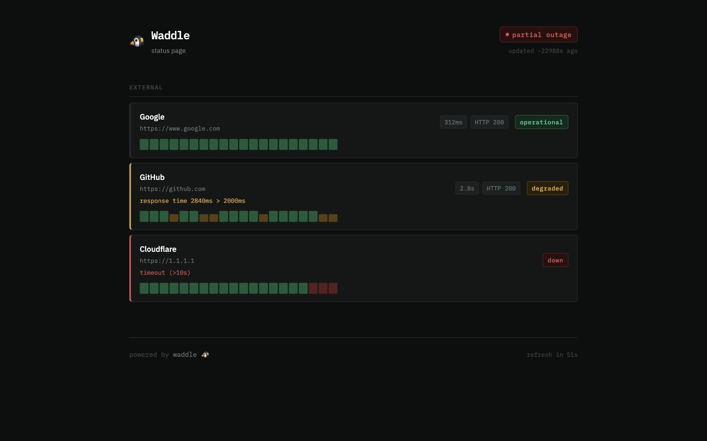

# Waddle 🐧

**Monitoring that stays alive when your infrastructure dies.**

[](LICENSE)
[](https://pages.github.com/)
[](https://docs.gitlab.com/ee/user/project/pages/)
[](CONTRIBUTING.md)
[](https://keegooroomie.github.io/waddle)

---

Small infrastructure setups — homelabs, indie SaaS, self-hosted stacks — often run monitoring on the same server they're monitoring. When that server goes down, the monitoring goes with it.

You get an alert from your users. Not from your tools.

Waddle is designed around one constraint: **the monitor must be independent from what it monitors.**

It runs on GitHub Actions, GitLab CI, or a Kubernetes CronJob in a separate environment. Your infrastructure can fail completely — Waddle still sees it, still reports it, still alerts you.

```
external CI runtime (GitHub / GitLab / Kubernetes)
  → monitor.py checks your endpoints from outside
  → writes status.json into the repository
  → alerts Telegram / Discord / Email / Webhook on status change
  → index.html renders the status page as a static file
```

**The CI runner is the monitor. The repository is the database. The static page is the dashboard.**

> **Live demo:** [keegooroomie.github.io/waddle](https://keegooroomie.github.io/waddle)



---

## Who Waddle is for

**Good fit:**
- Solo developers and indie SaaS projects
- Small infrastructure teams without dedicated SRE
- OSS maintainers who want a public status page
- Homelabs and self-hosted stacks
- Anyone who wants uptime verification independent from their own infra

**Not the right tool for:**
- High-frequency monitoring (sub-minute intervals)
- Deep metrics, tracing, or log aggregation
- Replacing Prometheus, Grafana, or Datadog
- Real-time observability infrastructure

Waddle is designed for **infrastructure survivability and operational simplicity** — not millisecond observability.

---

## Design goals

- Survive infrastructure failure by running outside it
- Require near-zero ongoing maintenance
- Avoid persistent backend state entirely
- Run on commodity CI platforms available to anyone for free
- Stay understandable in one evening

---

## Beyond Upptime

[Upptime](https://github.com/upptime/upptime) proved that GitHub can be used as monitoring infrastructure. Waddle expands the model:

|                          | Waddle | Upptime |
|--------------------------|:------:|:-------:|
| GitHub Actions           |   ✅   |   ✅    |
| GitLab CI                |   ✅   |   ❌    |
| Kubernetes CronJob       |   ✅   |   ❌    |
| Zero npm / build step    |   ✅   |   ❌    |
| Per-target alert routing |   ✅   |   ❌    |
| HTTP + TCP + SSL checks  |   ✅   |   ❌    |
| Maintenance windows      |   ✅   |   ❌    |
| One HTML file            |   ✅   |   ❌    |

---

## Quick start

### GitHub

**1.** Fork this repo. Go to **Settings → Actions → General → Workflow permissions → Read and write permissions**.

**2.** Go to **Settings → Pages → Source → GitHub Actions**.

**3.** Add secrets under **Settings → Secrets and variables → Actions**:

| Secret | Description |
|--------|-------------|
| `TELEGRAM_BOT_TOKEN` | Token from [@BotFather](https://t.me/BotFather) |
| `TELEGRAM_CHAT_ID` | Chat or channel ID |

**4.** Edit `targets.yaml` — add your services. Edit `config.json` — set your site name.

**5.** In `.github/workflows/monitor.yml`, uncomment the `schedule` block to enable automatic monitoring.

**6.** Go to **Actions → Waddle Monitor → Run workflow** to trigger the first run.

Your status page will be live at `https://YOUR_USERNAME.github.io/waddle/` in about a minute.

---

### GitLab

**1.** Fork on GitLab. Pages are enabled automatically for public repos.

**2.** Go to **Settings → CI/CD → Variables** and add:

| Variable | Value |
|----------|-------|
| `GITLAB_TOKEN` | PAT with `api` + `write_repository` scope |
| `TELEGRAM_BOT_TOKEN` | Token from @BotFather |
| `TELEGRAM_CHAT_ID` | Chat or channel ID |

**3.** Go to **CI/CD → Schedules → New schedule** — set interval to `*/15 * * * *`.

**4.** Edit `targets.yaml` and `config.json`, push to main.

---

### Kubernetes

```bash
kubectl create secret generic waddle-secrets \
  --from-literal=TELEGRAM_BOT_TOKEN=xxx \
  --from-literal=TELEGRAM_CHAT_ID=xxx

kubectl apply -f k8s/
```

The same `monitor.py` runs as a CronJob every 5 minutes. Status page served by nginx behind an Ingress. No Actions limits.

---

## How it works

```
cron trigger (external to your infrastructure)
  → monitor.py reads targets.yaml
  → substitutes ${ENV_VARS} from secrets
  → runs all checks in parallel (asyncio)
  → compares results with previous status.json
  → on status change → sends alerts to configured channels
  → writes updated status.json
  → commits and pushes (GitHub / GitLab mode)
```

No database. No backend service. No synchronization layer.
The repository is the source of truth.

---

## Configuration

### targets.yaml

Channels are defined once with a unique `id`. Targets reference channel ids in `notify` — different services can route to different channels independently.

```yaml
notifications:
  channels:
    - id: "tg"
      type: telegram
      token: "${TELEGRAM_BOT_TOKEN}"
      chat_id: "${TELEGRAM_CHAT_ID}"

    - id: "discord"
      type: discord
      webhook_url: "${DISCORD_WEBHOOK_URL}"

targets:
  - name: "My site"
    url: "https://example.com"
    type: http
    group: "production"
    notify: ["tg", "discord"]

  - name: "Mail server"
    url: "mail.example.com:25"
    type: tcp
    group: "infrastructure"
    notify: ["tg"]

  - name: "SSL cert"
    url: "https://example.com"
    type: ssl
    ssl_warn_days: 14
    group: "production"
    notify: ["tg"]
```

### Check types

| type | What it checks | Extra fields |
|------|---------------|--------------|
| `http` | Status code, response time, optional body text | `expected_status`, `check_text`, `slow_threshold_ms` |
| `tcp` | TCP connect to `host:port` | — |
| `ssl` | Days until certificate expires | `ssl_warn_days` (default 14) |

### Notification channels

| type | Required fields |
|------|----------------|
| `telegram` | `token`, `chat_id` |
| `discord` | `webhook_url` |
| `email` | `smtp_host`, `smtp_user`, `smtp_pass`, `to` |
| `webhook` | `url` |

All secret values use `"${VAR_NAME}"` syntax — substituted from environment at runtime.

### Maintenance windows

```yaml
- name: "Staging"
  url: "https://staging.example.com"
  notify: ["tg"]
  maintenance:
    enabled: true
    start: "2026-06-01T02:00:00Z"
    end:   "2026-06-01T04:00:00Z"
```

No alerts during maintenance. Yellow indicator on the status page.

---

## Alert format

```
🔴 DOWN — My site
https://example.com
Reason: timeout (>10s)
⏱ 14:32 UTC

🟢 UP — My site
Downtime: 8 min
⏱ 14:40 UTC

⚠️ SSL WARN — My site
Reason: expires in 11 days
⏱ 09:00 UTC
```

Alerts fire only on **status change**. No spam while a service stays down.

---

## GitHub Actions limits

| | Value |
|--|--|
| Free minutes/month | 2 000 (shared across all repos) |
| One monitor run | ~40 sec → billed as 1 min |
| Runs/month at 15 min interval | ~2 880 — fits free plan |
| Runs/month at 10 min interval | ~4 320 — exceeds free plan |

Recommended interval on free plan: **15 minutes**.
Check actual usage: **Settings → Billing → Actions usage**.
For 5-minute intervals: use Kubernetes or a paid plan.

---

## Project structure

```
waddle/
├── index.html              ← status page (zero npm, styles inline)
├── style.css
├── config.json             ← site name, timezone
├── targets.yaml            ← what to monitor, where to alert
├── status.json             ← results (auto-generated, do not edit)
├── monitor.py              ← monitoring script (asyncio + aiohttp)
├── requirements.txt
├── .github/
│   └── workflows/
│       ├── monitor.yml     ← cron, writes status.json, commits
│       └── deploy.yml      ← deploys Pages after monitor run
├── .gitlab-ci.yml          ← GitLab: monitor + pages in one file
├── k8s/
│   ├── cronjob.yaml
│   ├── deployment.yaml
│   ├── configmap.yaml
│   ├── ingress.yaml
│   └── secret.yaml.example
└── docs/
    ├── LLM-CONTEXT.md      ← context file for AI tools
    └── architecture.md
```

---

## Using AI to edit config

Drop `docs/LLM-CONTEXT.md` into Claude, ChatGPT, or Cursor along with your `targets.yaml`:

> *"Add Google to monitoring, alerts only to email"*
> *"Disable alerts for staging without removing it"*
> *"Add a Discord channel for the dev team, route only API alerts there"*

The model returns an updated `targets.yaml` ready to paste.

---

## Contributing

PRs are welcome. For large changes, open an issue first.

No setup required — edit `monitor.py` or `index.html` locally and run `python monitor.py` with a test `targets.yaml` to verify.

**Conventions:** `feat:` `fix:` `docs:` `chore:`

---

## Philosophy

Modern CI platforms — GitHub Actions, GitLab CI, Kubernetes — are already distributed infrastructure runtimes available to anyone for free.

Waddle treats them as a monitoring primitive: the CI runner is the monitor, the repository is the database, the static page is the dashboard. No persistent backend. No service to maintain. No infrastructure that can fail alongside the thing it watches.

This is a different operational model — not better metrics, not faster alerts, not deeper observability. Just monitoring that is structurally independent from what it monitors.

If your server is down, your monitoring should not be on the same server.

---

## License

[MIT](LICENSE) — © 2026 Alexander Gusarov ([@KeeGooRoomiE](https://github.com/KeeGooRoomiE))
